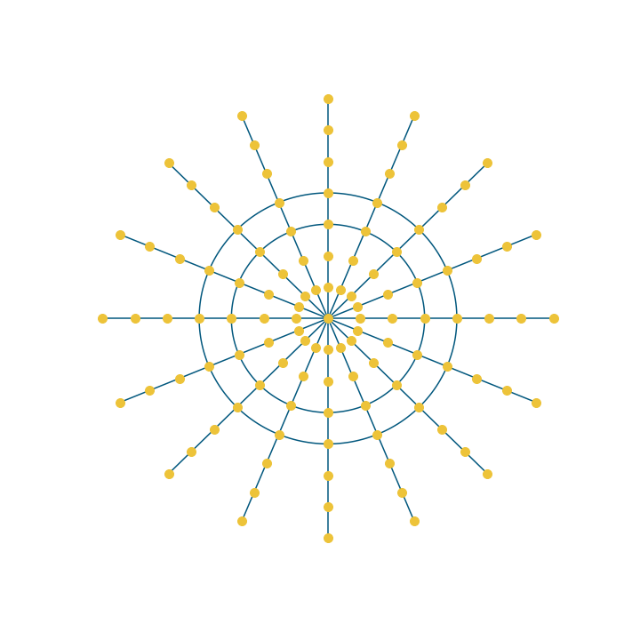

# Spatial Networks

A small library based on NetworkX and Shapely to manipulate Spatial Networks.

> This repository has two objectives:
>
> - learning about Spatial Networks
> - understanding how to create a Python package

If you want to see how this works, or at least where this is going, you can find a first notebook in the [notebooks](notebooks/01_basic_data_structures.ipynb) folder.

## RoadMap

- [x] Rewrite early code to integrate shapely
- [ ] Use releases so that automatic push is made to pypi

## TODO

- [ ] Add tests
- [ ] Add simpler drawing functions
- [ ] Better computations
- [ ] Add examples
- [ ] Find datasets

## Inspiration

- [Rémy Cabazet lecture](https://www.youtube.com/watch?v=KsGV_FHwhfY)
- [Marc Bathelemy book](https://link.springer.com/book/10.1007/978-3-030-94106-2)

## Resources

> - [Tutorial](https://towardsdatascience.com/deep-dive-create-and-publish-your-first-python-library-f7f618719e14)
> - [Related](https://github.com/tomalrussell/snkit)
